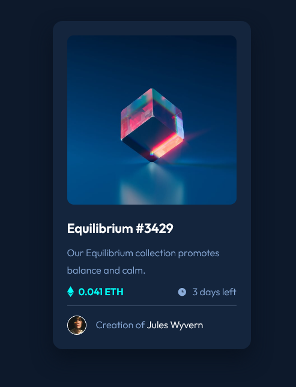

# Frontend Mentor - NFT preview card component solution

This is a solution to the [NFT preview card component challenge on Frontend Mentor](https://www.frontendmentor.io/challenges/nft-preview-card-component-SbdUL_w0U). Frontend Mentor challenges help you improve your coding skills by building realistic projects. 

## Table of contents

- [Overview](#overview)
  - [The challenge](#the-challenge)
  - [Screenshot](#screenshot)
  - [Links](#links)
- [My process](#my-process)
  - [Built with](#built-with)
  - [What I learned](#what-i-learned)
  - [Useful resources](#useful-resources)
- [Author](#author)

## Overview

### The challenge

Users should be able to:

- View the optimal layout depending on their device's screen size
- See hover states for interactive elements

### Screenshot

### Links

- Solution URL: [Add solution URL here](https://your-solution-url.com)
- Live Site URL: [Add live site URL here](https://your-live-site-url.com)

## My process

### Built with

- Semantic HTML5 markup
- CSS custom properties
- Flexbox
- CSS Grid

### What I learned

- How to create a hover overlay more or less simply via only HTML + CSS

### Useful resources

- [Stackoverflow Question which helped me to create an overlay](https://stackoverflow.com/questions/14263594/how-to-show-text-on-image-when-hovering) I've had problems for an evening and a half with creating an overlay and this question on stackoverflow had just the rightest and the simplest solution for it.

## Author

- Frontend Mentor - [@Quakumei](https://www.frontendmentor.io/profile/Quakumei)
- Github - [@Quakumei](https://github.com/Quakumei)

